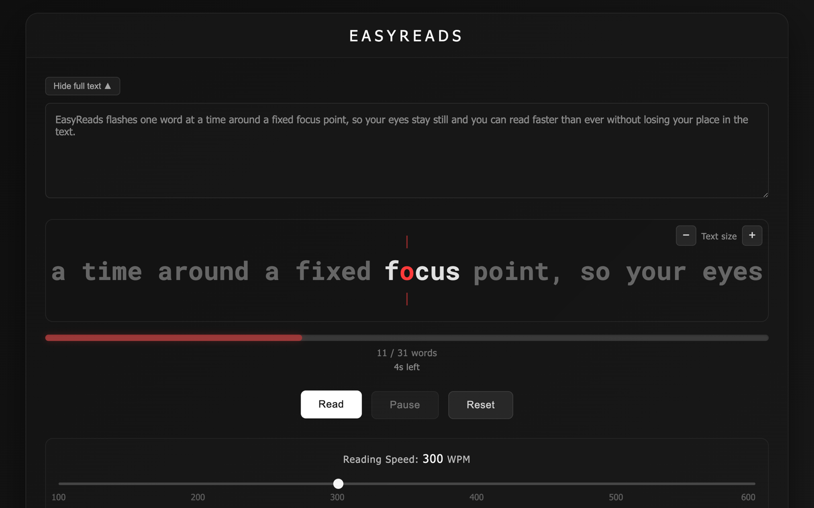

# EasyReads

A speed reader that runs in your browser. EasyReads shows your text one word at a time, and it lines each word up so one highlighted letter always sits in the same spot. Your eyes stay still and the words come to you. That lets you read faster without skimming.

**[Try it live →](https://ikibirdir.github.io/EasyReads/)** No install needed.



## Features

- **Fixation point:** each word is aligned on a highlighted red letter that never moves, so your eyes don't have to jump around.
- **Context preview:** the words before and after the current one stay visible, dimmed.
- **Adjustable speed:** 100–600 words per minute, with a live estimate of the time left.
- **Variable timing (optional):** longer words stay on screen longer, and the reader pauses briefly at commas and at the end of sentences.
- **Blink detection (optional):** uses your webcam to notice when you blink, then briefly pauses and repeats the word so you don't miss it.
- **Seekable progress bar:** click or drag it to jump anywhere in the text.
- **Remembers where you were:** your text, your position and your settings are saved in the browser.
- **Keyboard control:** press <kbd>Space</kbd> to pause or resume.

## Getting started

To just use EasyReads, open the [live version](https://ikibirdir.github.io/EasyReads/). To run it on your own computer or change the code, you need [Node.js](https://nodejs.org/) **20.19 or newer** (22 LTS is recommended).

```bash
git clone https://github.com/ikibirdir/EasyReads.git
cd EasyReads
npm install
npm run dev
```

Then open the address it prints, usually <http://localhost:5173>.

> **Why not just double-click `index.html`?** The app loads as a JavaScript module, and browsers block modules on pages opened straight from disk (`file://`). Webcam access also needs `localhost` or HTTPS. Run it with `npm run dev` or serve it as shown below.

### Build a copy you can host

```bash
npm run build     # outputs a static site to dist/
npm run preview   # serves dist/ locally to check it
```

`dist/` is plain HTML, CSS and JS with relative paths. You can put it on any static host, such as GitHub Pages, Netlify, Cloudflare Pages or your own web server. Blink detection needs the site to be served over HTTPS (or from `localhost`), because browsers only allow camera access there.

## How to use

1. Click **Start Reading**.
2. Paste or type your text into the box.
3. Press **Read** (or <kbd>Space</kbd>).
4. Adjust the speed slider and the toggles as you go. Click the progress bar to jump to another part of the text.
5. Click the **EasyReads** title to go back to the home screen.

| Control | What it does |
| --- | --- |
| <kbd>Space</kbd> | Pause / resume (when the text box isn't focused) |
| Speed slider | 100–600 WPM |
| Text size − / + | 50%–200% |
| Hide full text | Collapses the text box so you can focus on the reader |
| Variable Speed by Word Length | Longer words get more time on screen |
| Pause on Punctuation | 1.5× time on `, ; :` and 2× on `. ! ?` |
| Blink Detection | Pauses briefly each time you blink (asks for camera access) |

## Privacy

- **Your text stays on your device.** It's saved only in your browser's `localStorage` and never sent anywhere.
- **Camera frames never leave your browser.** Blink detection runs [MediaPipe Face Mesh](https://github.com/google-ai-edge/mediapipe) on your own machine. The camera is only on while you're reading with blink detection enabled.
- The page loads MediaPipe from the jsDelivr CDN and the Roboto Mono font from Google Fonts. Without internet access the reader still works, but blink detection won't, and the text falls back to a system monospace font.

To clear everything the app has saved, clear this site's data in your browser settings.

## Browser support

EasyReads works in any current version of Chrome, Edge, Firefox or Safari. Blink detection needs a webcam. How accurate it is depends on your lighting, your camera and whether you wear glasses. If it isn't reliable for you, just turn it off.

## Project structure

```
EasyReads/
├── index.html        # Page markup (home screen + reader)
├── src/
│   ├── main.js       # Reader logic, timing, progress saving, blink detection
│   └── styles.css    # All styles
├── public/
│   └── favicon.svg   # Copied as-is into the build
├── docs/             # Screenshots used in this README
├── .github/workflows/deploy.yml  # Builds every PR; deploys main to GitHub Pages
├── vite.config.js    # Build config (Vite)
└── package.json
```

The app has no frameworks and no runtime dependencies. [Vite](https://vite.dev/) is used only for the dev server and to build the static site.

## Contributing

Issues and pull requests are welcome. See [CONTRIBUTING.md](CONTRIBUTING.md).

## License

[MIT](LICENSE). You're free to use, modify and share this project, including commercially, as long as you keep the copyright notice.
